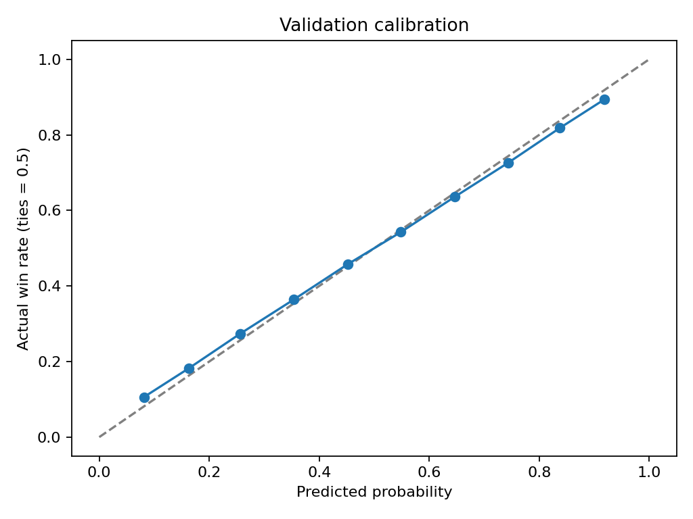

# Golf Elo: an educational first chapter

## 1. Why I Built This

I am learning machine learning by connecting coursework in statistics and computer science with my interest in markets and research. This project is my first attempt to turn a historical question into a measurable experiment: can a simple rating system capture enough persistent golfer performance to improve on basic head-to-head baselines?

This repository documents the first layer of a larger machine-learning research project. I am sharing the core concepts, an educational implementation, aggregate evaluation results, and the lessons I learned. I am intentionally not publishing the complete research pipeline, player-level predictions, current ratings, market-comparison logic, or later model layers. The goal is to make my learning process understandable without presenting this repository as a ready-to-use forecasting or trading system.

## 2. What This Model Does

The historical model estimates the probability that one golfer finishes ahead of another using information available before a tournament. It treats a tournament as many pairwise comparisons, rather than trying to name the tournament winner. The code here demonstrates that idea with fictional players and synthetic results. It reports aggregate evaluation only.

The historical research question was: **Do Elo ratings updated chronologically improve pairwise prediction of 2017–2022 tournament outcomes relative to a coin flip and previous-season finishing performance?** Seasons 2015–2016 provided warm-up history; 2017–2020 were used for parameter selection, and 2021–2022 for validation.

## 3. How Elo Works

Each player starts with a rating of 1500. A rating is a summary of past relative performance, not a score in strokes. A higher rating means the model expects that player to finish ahead more often.

For ratings A and B, the expected probability is `1 / (1 + 10 ** ((B - A) / 400))`. Equal ratings give 50%. For each golfer, I average the expected probabilities across all other golfers in the event. Actual performance is the fraction of opponents they finish ahead of, with ties counting as half a win.

The update is `new rating = old rating + K × (actual - expected)`. Surprising results cause larger changes; an expected win by a strong player earns less. All players update simultaneously using the same pre-event ratings, so the first update cannot influence the next player's expectation. With a common K, rating gains and losses sum to zero within an event. Optional season decay pulls ratings toward 1500 at a new season.

Chronological processing matters: a tournament's results become available only after its predictions. Same-date events receive predictions before any results from that date update ratings. This avoids using information from the event being predicted. Historical end dates alone cannot establish the start-time order of overlapping tournaments.

## 4. The Modeling Pipeline


This diagram describes the historical research workflow. The public executable runs a smaller version on the synthetic fixture. For every event, evaluation uses a frozen pre-event snapshot and then applies the update. Warm-up outcomes update ratings without being scored. Tuning chooses parameters using tuning log loss only; validation follows with those parameters frozen. There is no random split.

## 5. What the Results Mean

These are aggregate results from the **separate private historical study**, not results generated by the included synthetic example:

| Historical validation metric | Value |
| --- | ---: |
| Elo log loss | 0.6422 |
| Elo Brier score | 0.2148 |
| Elo pairwise accuracy | 62.65% |
| Coin-flip log loss | 0.6931 |
| Previous-season baseline log loss | 0.7231 |

The **62.65% accuracy refers to pairwise golfer comparisons**. It is not tournament-winner accuracy and is not a financial return. Lower log loss and Brier score mean better probability predictions under these scoring rules. Elo's validation log loss was about 7.35% lower than the coin-flip baseline. That is predictive improvement in this sample, not evidence of a profitable strategy.

The historical grid searched K in 10, 20, 30, 40, 60 and season decay in 0, 0.15, 0.25, 0.4. It selected K=60 and decay=0 from tuning only; tuning log loss was 0.6517. Validation included 581,732 unordered comparisons, but these are not independent observations. The historical ratings end on **June 5, 2022**.

The previous-season baseline favors the lower mean numerical finish rank from the prior season. It uses fixed 75%/25% confidence for its directional choice and 50% when history is unavailable or equal. That arbitrary confidence affects log loss. Ties have an outcome of 0.5 for all metrics; an exactly 50% prediction receives half-credit for accuracy. Each unordered pair has equal weight, so larger events contribute more comparisons.

### Why Event Weighting Matters

Pair-weighted evaluation answers how the model performs for a randomly selected golfer matchup. Equal-event evaluation answers how the model performs for the average tournament. Reporting both prevents large fields from silently dominating the conclusion.

An event with `n` golfers creates `n × (n - 1) / 2` pair comparisons. The fictional 2021 and 2022 validation events have four and six golfers, contributing six and fifteen pairs. Equal-event evaluation first averages each event's pair scores, then averages the two event scores. These comparisons within a tournament are related, which is why uncertainty in the private historical analysis is estimated by resampling complete tournaments.

| Synthetic Elo validation | Pair-weighted | Equal-event |
| --- | ---: | ---: |
| Log loss | 0.4445 | 0.4287 |
| Brier score | 0.1334 | 0.1262 |
| Pairwise accuracy | 88.10% | 91.67% |

These are synthetic teaching results, not historical findings. The historical numbers above remain pair-weighted, and parameter selection still uses pair-weighted tuning log loss.



This chart was exported from the private historical evaluation. It compares binned predicted probabilities with observed win fractions, counting ties as half. Both pair orientations are included for symmetry. It is a diagnostic, not a trained calibration model, and is not regenerated by the public example.

## 6. Data Quality

The historical file was already one row per player per tournament. Total strokes were not summed across duplicate rows. There were 21 surplus duplicate player–event rows; they were collapsed only after confirming equal scores, rounds, season, and date. Some finish labels conflicted, so outcomes used scores and rounds. Unique player IDs were checked against names in both directions; no identity conflicts were found.

Withdrawals, disqualifications, incomplete or unusable results were removed. Events without usable completed fields were skipped. Known unsupported formats were filtered by event name; the source lacked an explicit competition-format flag, so this check has limits. Fields, event counts, duplicate keys, and chronological season consistency were checked.

Two date/season conflicts were excluded rather than assigned invented dates: event 2726 (Puerto Rico Open) had a March 2016 date with a 2017 season label; event 3747 (Sony Open in Hawaii) had a November 2018 date with a 2018 label. A season-window plausibility check found no additional conflicts. These checks do not independently authenticate every recorded event date. No private raw records are included here.

Four rounds were treated as making the cut. Two-round missed-cut totals were ranked behind completed players. For legitimate three-round cuts, the historical study used `total strokes / rounds × 2` as a 36-hole-equivalent approximation because actual first-two-round scores were unavailable. Holes played were inferred as 18 times rounds, not observed. The public fixture deliberately uses only complete two-round cuts and four-round finishes, so it does not implement the historical three-round approximation.

For original-data provenance, schema requirements, and acquisition steps, see [DATA_REQUIREMENTS.md](DATA_REQUIREMENTS.md). Acquiring that source alone does not make this public edition reproduce the private results.

## 7. What I Am Sharing

I am sharing the educational baseline, general methodology, tests of modeling assumptions, aggregate evaluation, and selected visualizations so readers can follow my learning process. All names, IDs, dates, and scores in the public sample are invented. The sample demonstrates mechanics and does not represent professional golfers.

## 8. What I Am Keeping Private

I am intentionally retaining the complete research pipeline, player-level outputs, individual predictions, current data, market comparison logic, and later model layers as private research. Raw historical data, current ratings, leaderboards, prediction audits, newer holdouts, and future trading logic are not included. This edition contains no matchup service or saved player-level forecasting output.

## 9. Sharing Boundary

Transparency does not require publishing every operational detail. I want to document the concepts, mistakes, methodology, and learning process while preserving parts of a larger research project that I am still developing. This public chapter contains a synthetic Elo example and selected aggregate results from the separate historical study. Raw data, player-level outputs, operational research code, and the implementation and detailed results of later model layers remain private. The public example cannot reproduce the historical results.

## 10. Limitations

- Historical data only; historical ratings stop in June 2022.
- Pairwise predictions are not tournament-win predictions.
- No betting profitability was tested.
- No market costs or execution were modeled.
- Cut scoring includes documented approximations in the historical study.
- Pairwise observations from the same tournament are related; large fields receive greater evaluation weight.
- Source coverage may omit entrants, dates were not exhaustively verified, and end dates cannot fully resolve overlapping events.
- The public implementation is an educational baseline, not a complete, current, or ready-to-use forecasting system.
- The synthetic fixture is too small and artificial to support empirical claims; its validation metrics do not reproduce the historical table or chart.

## 11. Roadmap

1. Elo as layer one: learn chronology, baselines, and probability scoring. This is the public chapter.
2. Logistic regression: completed as a later private research layer. Its implementation and detailed results remain outside this public Elo chapter.
3. Further feature research.
4. Gradient-boosted trees.
5. Probability calibration.
6. Ensembles.
7. Eventual market comparison.

Items 3–7 are future research directions; none of the later layers is implemented in this public chapter.

## 12. Reproducing the Educational Example

Use Python 3.10+ from the repository directory. No external dependencies, credentials, downloads, or network access are needed:

```sh
python3 -B -m unittest discover -s tests -v
python3 -B main.py
```

These commands load only `examples/synthetic_results.csv`. The demonstration prints pair-weighted and equal-event synthetic tuning and validation metrics and does not export ratings, individual predictions, or data files. It uses the same warm-up/tuning/validation season labels and candidate grid as the historical study, but invented events and a simplified data loader. It cannot reproduce the reported historical validation numbers. Historical aggregates live in [results/historical_summary.json](results/historical_summary.json) as a static record, not executable output.
